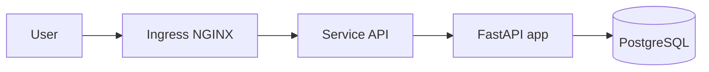

# Booking Restaurant — Portfolio CI/CD & Cloud

## What (en deux phrases)
- Une API FastAPI de réservation de restaurant, branchée sur PostgreSQL, emballée en Docker et déployable sur Kubernetes (kind).
- Projet portfolio pour montrer une maîtrise de bout en bout : Git, tests automatisés, CI/CD GitHub Actions, observabilité, sécurité, et amorce d’IaC (Terraform/AWS à venir).

## Why / How to read
- Public cible : recruteurs, managers, tech leads qui veulent vérifier la capacité à monter un workflow pro.
- Comment lire :
  - 📄 Les tickets sources font foi : [docs/tasks/](docs/tasks/) (M0 → M9).
  - 🔧 Les commandes détaillées sont dans [docs/DEV.md](docs/DEV.md) (docker compose, kind, qualité/sécurité).
  - 🧭 Ce README offre la vue d’ensemble et les raccourcis utiles.

## Milestones (from tasks)
Mini timeline des jalons issus de `docs/tasks` et réellement livrés :
- **M0 — Foundation** : endpoint `GET /health`, premiers tests pytest, Docker Compose API+Postgres, CI simple (tests API). [Ticket](docs/tasks/2025-12-16_M0-foundation.md)
- **M1 — Create** : `POST /reservations` en mémoire avec validation Pydantic + tests. [Ticket](docs/tasks/2025-12-16_M1-create-reservation.md)
- **M2 — PostgreSQL** : persistance Postgres (schema SQL idempotent), `DATABASE_URL` via env, Compose prêt à l’emploi. [Ticket](docs/tasks/2025-12-16_M2-postgres-persistence.md)
- **M3 — List** : `GET /reservations` lit la DB et renvoie la liste triée. [Ticket](docs/tasks/2025-12-16_M3-list-reservations.md)
- **M4 — Cancel** : `DELETE /reservations/{id}` (204 ou 404) + tests d’intégration. [Ticket](docs/tasks/2025-12-16_M4-cancel-reservation.md)
- **M5 — kind deploy** : manifests K8s (namespace, Postgres, API, secrets/config, probes) déployés sur kind. [Ticket](docs/tasks/2025-12-16_M5-kind-deploy.md)
- **M6 — CI kind smoke** : workflow GitHub Actions qui build l’image, crée un cluster kind, charge l’image et vérifie `/health`. [Ticket](docs/tasks/2025-12-16_M6-ci-kind-smoke.md)
- **M7 — Ingress** : ingress-nginx pour exposer l’API en local (ports 80/443) et stabiliser les checks.
- **M8 — Observability** : logs structurés avec `request_id`, metrics Prometheus via `/metrics`. [Ticket](docs/tasks/2025-12-16_M8-observability.md)
- **M9 — Quality & Security** : pre-commit + Ruff, Bandit, pip-audit, Trivy image scan, Dependabot, workflows QA dédiés. [Ticket](docs/tasks/2025-12-16_M9-quality-security.md)

## Architecture (vue simple)


## How to run (Quickstart)
- **Docker Compose (local rapide)**
  - `docker compose up --build api db`
  - Tester : `curl http://localhost:8000/health`, `curl http://localhost:8000/reservations`.
  - Arrêt : `docker compose down`.
- **Kubernetes kind (déploiement proche prod)**
  - `kind create cluster --name booking --config k8s/local-kind/kind-config.yaml`
  - Installer ingress-nginx : `kubectl apply -f https://raw.githubusercontent.com/kubernetes/ingress-nginx/main/deploy/static/provider/kind/deploy.yaml` puis attendre Ready.
  - `docker build -t booking-api:local apps/api && kind load docker-image booking-api:local --name booking`
  - `kubectl apply -k k8s`
  - Vérifier : `curl http://localhost/health`, `curl http://localhost/reservations`.
- **Endpoints clés à tester** : `/health` (probe), `POST/GET/DELETE /reservations`, `/metrics` (Prometheus, à ne pas exposer publiquement).

## CI/CD
- Workflows GitHub Actions :
  - `api-ci` : installe dépendances + pytest.
  - `qa-security` : Ruff (lint/format), Bandit, pip-audit, scan Trivy sur l’image.
  - `kind-smoke` : build image, cluster kind éphémère, kustomize, smoke `/health` via port-forward.
- Pipeline simplifié :
```mermaid
graph LR
    A[Push / PR] --> B[Lint + Tests (api-ci)]
    B --> C[Security (Bandit + pip-audit + Trivy)]
    C --> D[Build image]
    D --> E[kind cluster + kustomize]
    E --> F[Smoke test /health]
```

## Observability
- Logs JSON avec `timestamp`, `method`, `status_code`, `duration_ms`, `request_id` (middleware FastAPI).
- Metrics Prometheus automatiques via `prometheus-fastapi-instrumentator` sur `/metrics` (utilisé aussi en kind CI pour vérifier la santé).

## Security & Quality
- Qualité : Ruff (lint/format), tests pytest (unit + intégration DB marquée `integration`).
- Sécurité : Bandit ciblé sur le code app, pip-audit sur les dépendances Python, Trivy sur l’image Docker, Dependabot pour Python + Actions.
- Pré-commit configuré pour exécuter Ruff automatiquement côté dev.

## Challenges rencontrés & fixes
- **Chargement d’image dans kind** : les pods restaient en pull error → ajout explicite de `kind load docker-image booking-api:local` en dev et en CI.
- **Ingress 503** : stabilisé en installant ingress-nginx via le manifest officiel et en attendant le readiness avant les tests (voir commandes kind ci-dessus).
- **Endpoint `/metrics` manquant** : instrumentation ajoutée via `Instrumentator().expose(...)` pour livrer les métriques Prometheus et éliminer les 404.
- **Bandit / pip-audit / Trivy bruyants** : scope resserré sur le code app, dépendances ajustées (alignement FastAPI/Starlette) et image scan configuré pour ne remonter que HIGH/CRITICAL.

## Roadmap (reste à faire)
- Terraform + AWS (ECR/EKS) avec OIDC GitHub Actions (pas de clés statiques).
- Frontend React (apps/web) et design UI.
- Authentification basique (JWT ou OAuth2) et rôles.
- Migrations DB automatisées (Alembic) et données de démo.
- Tests end-to-end et monitoring Prometheus/Grafana sur kind.

## Compétences démontrées
- **Backend** : FastAPI, Pydantic, psycopg, tests pytest.
- **Data** : PostgreSQL, schéma SQL idempotent, docker-compose pour la persistance.
- **Containers** : Docker build, multi-services compose.
- **Kubernetes** : kustomize, ingress-nginx, probes, secrets/configmaps, kind local.
- **CI/CD** : GitHub Actions multi-jobs, smoke tests sur cluster éphémère.
- **Observability** : logs structurés, métriques Prometheus.
- **Qualité & Sécurité** : Ruff, pre-commit, Bandit, pip-audit, Trivy, Dependabot.
