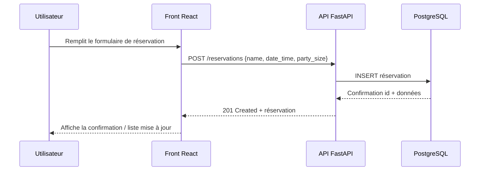

# ARCHITECTURE — Restaurant Booking Platform

## Vue d’ensemble
Plateforme de réservation composée d’un front React, d’une API FastAPI et d’une base PostgreSQL. Les déploiements locaux utilisent Docker Compose ou kind (Kubernetes local) ; la cible cloud est AWS (ECR + EKS) provisionnée par Terraform. CI/CD via GitHub Actions (OIDC recommandé) pour builder/pousser les images puis déployer sur EKS.

## High-level components (Mermaid)
```mermaid
graph LR
    User[Utilisateur] --> Web[Front React (Vite)]
    Web -->|HTTPS/REST| API[API FastAPI]
    API -->|SQL| DB[(PostgreSQL)]
    API -->|Images| ECR[(AWS ECR)]
    CI[CI GitHub Actions] -->|Build/Push| ECR
    CI -->|Deploy| EKS[(AWS EKS)]
    API -.->|Deploy manifests| EKS
    Web -.->|Deploy assets| EKS
```

## Runtime flow (Mermaid)


## Environnements
- **Local dev** : Docker Compose (`docker-compose.dev.yml`) pour API + DB + Adminer (+ front optionnel). kind pour tester les manifests K8s.
- **CI/CD** : GitHub Actions pour lint/tests, build/push images vers ECR (OIDC), déploiement vers EKS.
- **Cloud** : AWS (ECR pour les images, EKS pour le cluster). Terraform gère le réseau, le cluster et les ressources associées.

## Principes clés
- Séparation claire front/API/DB, contrats REST stables.
- Aucun secret en dépôt ; préférer variables d’environnement/OIDC/secrets GitHub.
- Manifests et Terraform maintenus en phase avec l’architecture (mettre à jour ce document lors des évolutions).
